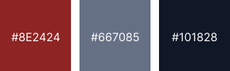
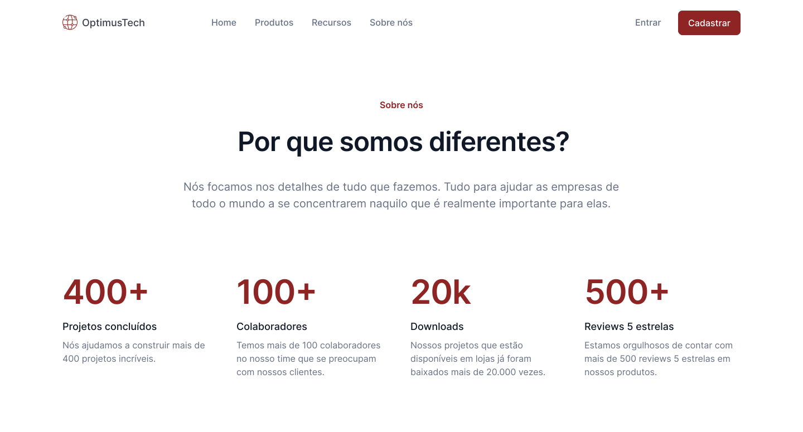

<h1 align="center">OptimusTech - Diovane Alves</h1>

Esse projeto faz parte dos desafios <a href="https://7daysofcode.io/" style="color:#8e2424">7DaysOfCode by Alura</a> que serve para mostrar a presença de uma empresa na Área de Desenvolvimento Full Stack na WEB. Falando um pouco sobre a empresa as Vagas Abertas, Avaliações dos colaboradores é o link para contato.

Caso, queira entrar em contato comigo caso tenha algum feedback ou idéias para meu portfólio ficaria muito agradecido. Deixe uma ⭐ se você gostou!

#7DaysOfCode #feedback7DoC

    
    

<h3 align="center"><a href="#" style="color:#8e2424">Clique para visitar o projeto</a></h3>

<h2 align="center">Melhorias</h2>

-  [ ] Responsividade em dispositivos Mobile.
-  [ ] Animação ao rolar a página.
-  [ ] Personalização da Scroll Bar.

<h2 align="center" style="font-size:30px">Tecnologias Utilizadas.</h2>
<h3>Para o desenvolvimento desse site foram utilizados as seguintes tecnologias. </h3>

-  HTML.
-  CSS.

<h2 align="center">Autor</h2>
<table>
  <tr>
    <td>
        
            <a href="https://github.com/diovanealves" style="color:#8e2424" align="center">
                
Github

            </a>
            <a href="https://www.linkedin.com/in/diovane-alves-de-oliveira-5320a0217/" style="color:#8e2424" align="center">
                
Linkedin

            </a>
            <a href="https://twitter.com/deluxyfps" style="color:#8e2424" align="center">
                
Twitter

            </a>
    </td>
  </tr>
</table>
